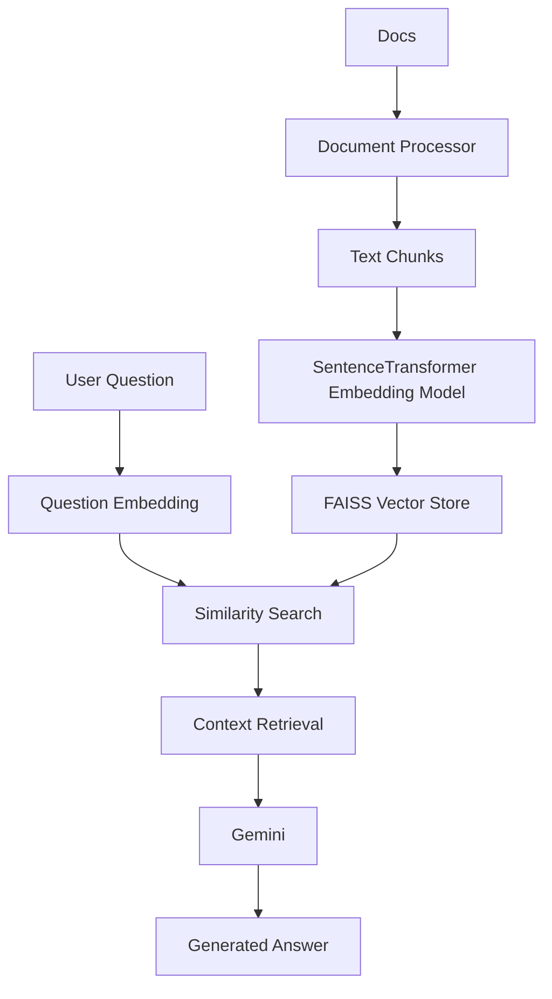
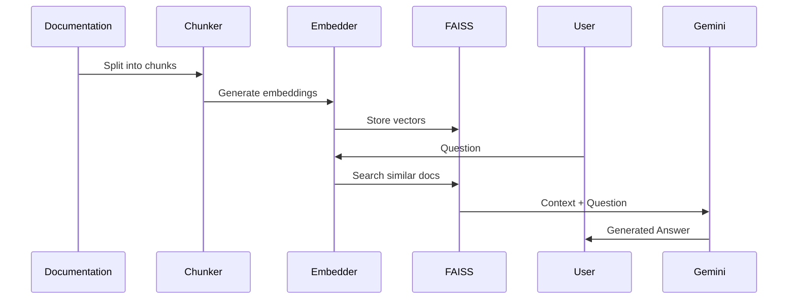

# Gita AI Rag chat bot 🤖

An intelligent assistant that uses Google's Gemini AI to provide accurate answers about Gita.

## System Architecture



## 🚀 Quick Start

### Using Docker

```bash

# 2. Build and start the container
docker-compose up --build -d

# 3. Check service status
docker-compose ps

# 4. Test the API (health check)
curl http://localhost:8080/health

# To stop the container
docker-compose down

# View logs
docker-compose logs -f
```

### Local Development Setup

```bash
# Create virtual environment
python -m venv venv

# Activate virtual environment
source venv/bin/activate  # Linux/Mac
# or
venv\Scripts\activate    # Windows

# Install dependencies
pip install -r requirements.txt

# Run the application
python main.py
```

## 📁 Project Structure

```
project/
├── data/
│   ├── processed/
│   │   ├── faiss_index/    # Vector embeddings
│   │   └── chunks/         # Processed text chunks
│   └── raw/                # Raw documentation
├── src/
│   ├── core/              # Core processing logic
│   ├── api/               # API endpoints
│   ├── services/          # Gemini integration
│   └── utils/             # Helper functions
├── Dockerfile
├── requirements.txt
└── main.py
```

## 🔄 Processing Pipeline



## 🛠️ Key Components

### 1. Document Processor

- Splits documentation into manageable chunks
- Maintains document structure
- Processes markdown formatting

### 2. Embedding System

- Uses SentenceTransformer for generating embeddings
- Converts text chunks to vectors
- Optimizes for technical content

### 3. Vector Store (FAISS)

- Fast similarity search
- In-memory vector storage
- Efficient retrieval

### 4. Response Generator

- Context-aware answers
- Technical accuracy
- Natural Gen Ai language responses

## 📡 API Endpoints

### Ask Question

```bash
POST /api/chat
Content-Type: application/json

{
    "question": "Who is arjuna?",
    "max_context": 3  # Optional: Number of relevant chunks to use
}
```
```bash
curl -X POST http://localhost:8080/api/v1/ask \
  -H "Content-Type: application/json" \
  -d '{"question": "What is the concept of dharma in the Gita?"}'
```

### Health Check

```bash
GET /health
```

## 🔧 Configuration

### Environment Variables

```env


GEMINI_API_KEY=

# Application Settings
APP_ENV="development"
DEBUG=True
PORT=8000


# Embedding Model Configuration
EMBEDDING_MODEL="all-mpnet-base-v2"

# Processing Configuration
CHUNK_SIZE=1000
CHUNK_OVERLAP=100
MAX_TOKENS=8192
```

### Docker Configuration

```dockerfile
- **Multi-stage Build** - Reduces final image size (~300MB)
- **Security First** - Non-root user with minimal privileges
- **Production-Ready** - Environment variables & health checks
- **Efficient Caching** - Optimized layer caching for faster builds
Refer dockerfile for more details
```

## 📊 Performance Considerations

- Embedding Generation: ~100ms per chunk
- Search Latency: ~50ms
- Response Generation: ~500ms
- Memory Usage: ~500MB base + ~100MB per 1000 chunks

## 🔍 Monitoring

Monitor system health:

```bash
curl http://localhost:8000/health
```

## 🚨 Error Handling

- Documents missing/corrupted
- Embedding generation failures
- Search index errors
- Response generation timeout

## 🔐 Security

- Input sanitization
- Error message sanitization
