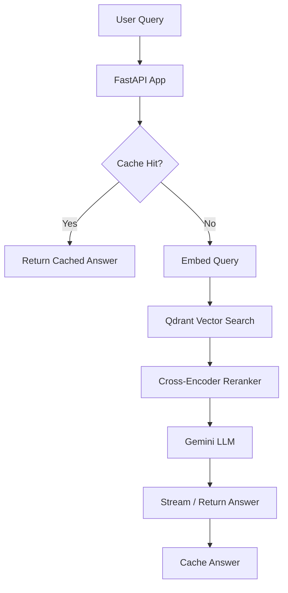

# Gita AI RAG API v2.0

A high-performance, async-first Retrieval-Augmented Generation (RAG) API for the Bhagavad Gita. Built with FastAPI, Qdrant, and Google Gemini.

## Architecture


```mermaid
graph TD
    A[User Query] --> B[FastAPI App]
    B --> C{Cache Hit?}
    C -->|Yes| D[Return Cached Answer]
    C -->|No| E[Embed Query]
    E --> F[Qdrant Vector Search]
    F --> G[Cross-Encoder Reranker]
    G --> H[Gemini LLM]
    H --> I[Stream / Return Answer]
    I --> J[Cache Answer]
```

## Tech Stack

| Component | Technology |
|-----------|-----------|
| **Framework** | FastAPI (async ASGI) |
| **Vector DB** | Qdrant (local mmap mode) |
| **Embeddings** | Gemini Embedding 2 (Preview, 3072-dim) |
| **LLM** | Google Gemini 3 Flash Preview |
| **Reranker** | BGE Reranker (sentence-transformers) |
| **Cache** | Redis (optional) / In-memory LRU |
| **HTTP Client** | httpx with connection pooling |
| **Validation** | Pydantic v2 |

## Quick Start

### Prerequisites

- Python 3.10+
- [Google Gemini API Key](https://aistudio.google.com/app/apikey)

### Local Development

```bash
# Clone and enter directory
cd rag-python-gita

# Create virtual environment
python3 -m venv .venv

# Activate
source .venv/bin/activate  # macOS/Linux
# .venv\Scripts\activate   # Windows

# Install dependencies
pip install -r requirements.txt

# Set environment variables
cp .env.example .env
# Edit .env and add your GEMINI_API_KEY

# Run the application
python main.py
```

The API will be available at `http://localhost:8080`.

### Using Docker Compose (Recommended for Production)

```bash
# Start app + Redis
docker-compose up --build -d

# Check health
curl http://localhost:8080/health

# View logs
docker-compose logs -f

# Stop
docker-compose down
```

## API Documentation

Auto-generated docs are available at:
- **Swagger UI**: `http://localhost:8080/docs`
- **ReDoc**: `http://localhost:8080/redoc`

### Endpoints

| Method | Endpoint | Auth | Description |
|--------|----------|------|-------------|
| GET | `/health` | No | Health check |
| GET | `/api/v1/health` | No | Detailed health + vector count |
| POST | `/api/v1/ask` | Bearer | Ask a question |
| POST | `/api/v1/search` | Bearer | Direct semantic search |

### Ask a Question

```bash
curl -X POST http://localhost:8080/api/v1/ask \
  -H "Content-Type: application/json" \
  -H "Authorization: Bearer <YOUR_API_KEY>" \
  -d '{
    "question": "What is the concept of dharma in the Gita?",
    "context_limit": 5,
    "chapter_filter": 2
  }'
```

**Response:**
```json
{
  "answer": "Dharma in the Bhagavad Gita refers to...",
  "citations": [],
  "model_used": "gemini-3-flash-preview",
  "context_chunks_used": 5,
  "query_time_ms": 850.2
}
```

### Streaming Response

```bash
curl -X POST http://localhost:8080/api/v1/ask \
  -H "Content-Type: application/json" \
  -H "Authorization: Bearer <YOUR_API_KEY>" \
  -d '{
    "question": "What is karma yoga?",
    "stream": true
  }'
```

Returns Server-Sent Events (SSE) with tokens streamed in real-time.

### Search Chapters by Speaker

```bash
curl -X POST http://localhost:8080/api/v1/search \
  -H "Content-Type: application/json" \
  -H "Authorization: Bearer <YOUR_API_KEY>" \
  -d '{
    "query": "duty and action",
    "k": 5,
    "speaker_filter": "Krishna",
    "chapter_filter": 3
  }'
```

## Project Structure

```
.
├── app/
│   ├── main.py              # FastAPI app with lifespan management
│   ├── state.py             # Shared application state
│   ├── config.py            # Pydantic v2 settings
│   ├── api/
│   │   ├── models.py        # Request/response Pydantic models
│   │   ├── routes.py        # FastAPI endpoints
│   │   └── deps.py          # Dependencies (auth, rate limiting)
│   ├── core/
│   │   ├── chunker.py       # Document chunking
│   │   ├── embedder.py      # Async embedding with cache
│   │   └── searcher.py      # Qdrant search + reranker
│   ├── services/
│   │   ├── gemini.py        # Async Gemini HTTP client
│   │   ├── cache.py         # Redis + in-memory cache
│   │   └── rag_engine.py    # RAG orchestration
│   └── utils/
│       ├── logger.py        # Structured JSON logging
│       └── helpers.py       # Utility functions
├── tests/
│   ├── test_api_models.py   # Model validation tests
│   ├── test_chunker.py      # Chunking logic tests
│   └── test_app.py          # Integration tests
├── data/
│   ├── raw/
│   │   └── gita.md          # Source text
│   └── processed/
│       └── chunks/          # Processed JSON chunks
├── main.py                  # Entry point (uvicorn)
├── requirements.txt
├── pytest.ini
├── docker-compose.yml
├── Dockerfile
├── .env                     # Environment variables (not committed)
└── .env.example             # Environment template
```

## Configuration

All configuration is done via environment variables or `.env` file.

### Required

| Variable | Description |
|----------|-------------|
| `GEMINI_API_KEY` | Your Google Gemini API key |

### Optional

| Variable | Default | Description |
|----------|---------|-------------|
| `API_KEY` | `dev-key-change-in-production` | Bearer token for API auth |
| `PORT` | `8080` | Server port |
| `HOST` | `0.0.0.0` | Server host |
| `REDIS_URL` | *(empty)* | Redis URL (empty = in-memory cache) |
| `QDRANT_PATH` | `data/qdrant_storage` | Local Qdrant storage path |
| `ENABLE_RERANKER` | `false` | Enable cross-encoder reranking |
| `RERANKER_MODEL` | `BAAI/bge-reranker-base` | Reranker model name |
| `GEMINI_MODEL` | `gemini-3-flash-preview` | LLM for generation |
| `EMBEDDING_MODEL` | `gemini-embedding-2-preview` | Embedding model (3072-dim) |
| `EMBEDDING_VECTOR_SIZE` | `3072` | Must match embedding model dimensions |

See `.env.example` for the full list.

## How It Works

1. **Startup**: The app processes `gita.md` into semantic chunks, generates embeddings via Gemini, and stores them in Qdrant.
2. **Query**: User question is embedded, searched in Qdrant (with optional chapter/speaker filters).
3. **Rerank**: Top-k*2 candidates are reranked by a cross-encoder for higher accuracy.
4. **Generate**: Best chunks + question are sent to Gemini for a contextual answer.
5. **Cache**: Embeddings and answers are cached to minimize API calls.

## Testing

```bash
# Run all tests
pytest tests/ -v

# With coverage
pytest tests/ -v --cov=app
```

## Performance Characteristics

| Metric | Approximate |
|--------|-------------|
| Embedding latency | ~100ms per chunk (cached after first call) |
| Vector search | ~10-30ms (Qdrant local mmap) |
| Reranking | ~50-200ms (depends on model) |
| LLM generation | ~500-2000ms (streaming reduces perceived latency) |
| Memory (base) | ~300MB (without reranker loaded) |
| Memory (with reranker) | ~700MB |

## Docker

The Dockerfile uses a multi-stage build for a smaller final image:

```dockerfile
# Build stage
FROM python:3.12-slim as builder
# ... installs dependencies into virtualenv

# Runtime stage
FROM python:3.12-slim
COPY --from=builder /opt/venv /opt/venv
# ... runs as non-root user
```

## Roadmap

- [ ] Hybrid search (dense + BM25 keyword)
- [ ] Knowledge graph with Neo4j (GraphRAG)
- [ ] Conversation memory + multi-turn RAG
- [ ] Langfuse observability tracing
- [ ] RAGAS automated evaluation

## License

MIT
