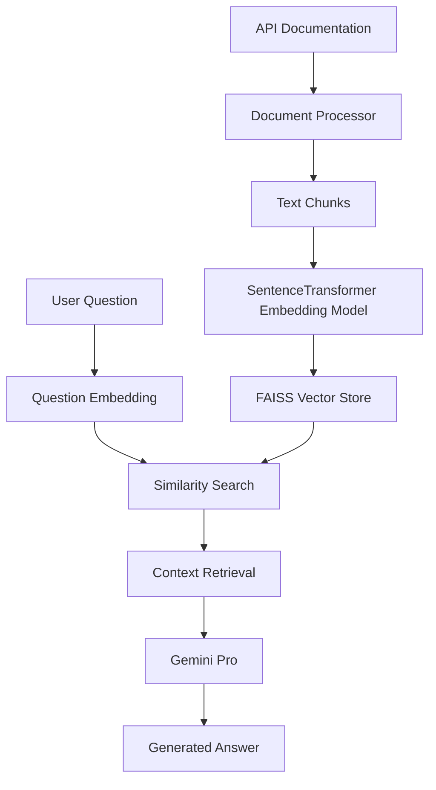

# Gita AI Rag chat bot 🤖

An intelligent assistant that uses Google's Gemini AI to provide accurate answers about Gita.

## System Architecture



## 🚀 Quick Start

### Using Docker

```bash
# Build the image
docker build -t crustdata-assistant .

# Run the container
docker run -p 8000:8000 \
  -e GEMINI_API_KEY=your_key_here \
  crustdata-assistant
```

### Local Development Setup

```bash
# Create virtual environment
python -m venv venv

# Activate virtual environment
source venv/bin/activate  # Linux/Mac
# or
venv\Scripts\activate    # Windows

# Install dependencies
pip install -r requirements.txt

# Run the application
python main.py
```

## 📁 Project Structure

```
project/
├── data/
│   ├── processed/
│   │   ├── faiss_index/    # Vector embeddings
│   │   └── chunks/         # Processed text chunks
│   └── raw/                # Raw documentation
├── src/
│   ├── core/              # Core processing logic
│   ├── api/               # API endpoints
│   ├── services/          # Gemini integration
│   └── utils/             # Helper functions
├── Dockerfile
├── requirements.txt
└── main.py
```

## 🔄 Processing Pipeline


## 🛠️ Key Components

### 1. Document Processor

- Splits documentation into manageable chunks
- Maintains document structure
- Processes markdown formatting

### 2. Embedding System

- Uses Gemini for generating embeddings
- Converts text chunks to vectors
- Optimizes for technical content

### 3. Vector Store (FAISS)

- Fast similarity search
- In-memory vector storage
- Efficient retrieval

### 4. Response Generator

- Context-aware answers
- Technical accuracy
- Natural language responses

## 📡 API Endpoints

### Ask Question

```bash
POST /api/chat
Content-Type: application/json

{
    "question": "Who is arjuna?",
    "max_context": 3  # Optional: Number of relevant chunks to use
}
```

### Health Check

```bash
GET /health
```

## 🔧 Configuration

### Environment Variables

```env


GEMINI_API_KEY=

# Application Settings
APP_ENV="development"
DEBUG=True
PORT=8000


# Embedding Model Configuration
EMBEDDING_MODEL="all-mpnet-base-v2"

# Processing Configuration
CHUNK_SIZE=1000
CHUNK_OVERLAP=100
MAX_TOKENS=8192
```

### Docker Configuration

```dockerfile
FROM python:3.9-slim

COPY requirements.txt .
RUN pip3 install -r requirements.txt

COPY . .
RUN mkdir -p data/raw data/processed/faiss_index data/processed/chunks logs

CMD ["python", "main.py"]
```

## 📊 Performance Considerations

- Embedding Generation: ~100ms per chunk
- Search Latency: ~50ms
- Response Generation: ~500ms
- Memory Usage: ~500MB base + ~100MB per 1000 chunks

## 🔍 Monitoring

Monitor system health:

```bash
curl http://localhost:8000/health
```

## 🚨 Error Handling

- Documents missing/corrupted
- Embedding generation failures
- Search index errors
- Response generation timeout

## 🔐 Security

- Input sanitization
- Error message sanitization
